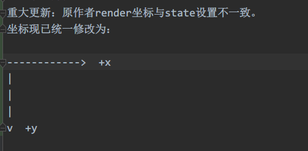
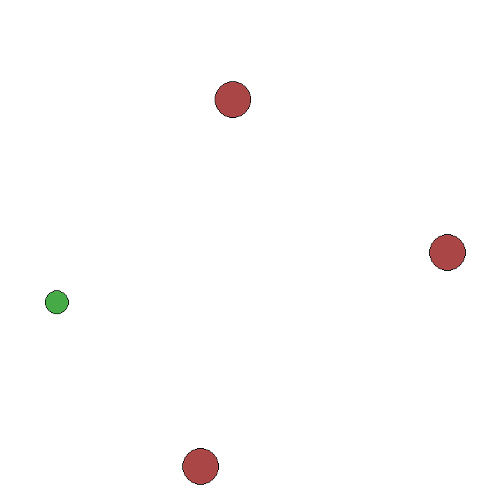
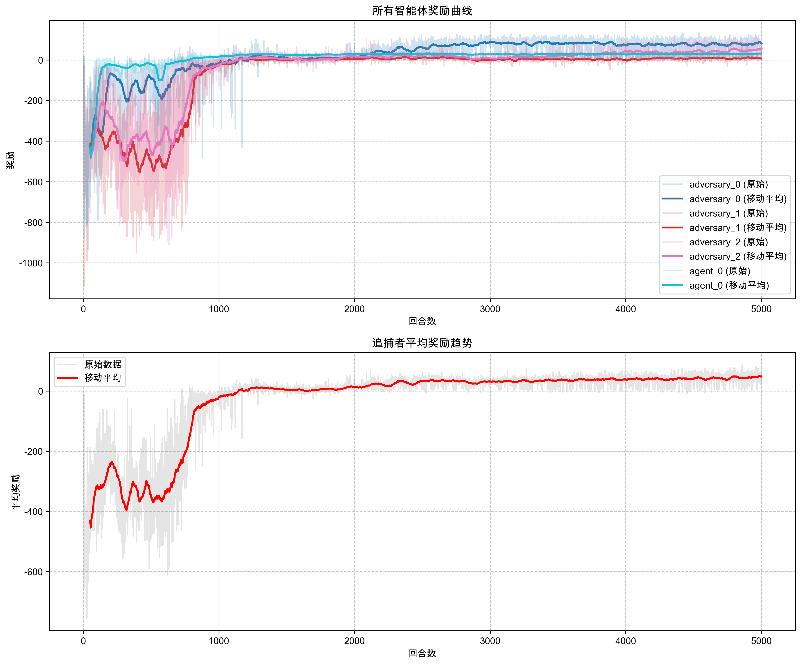
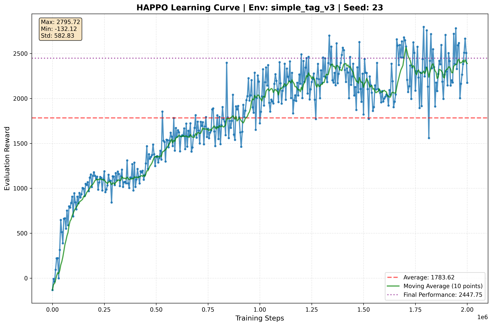

# Reinforcement Learning and Multi-Agent Reinforcement Learning Projects

🇺🇸 English | [🇨🇳 中文文档](./README.md)

   

This repository contains multiple projects related to Reinforcement Learning (RL) and Multi-Agent Reinforcement Learning (MARL), including both reproductions of classic algorithms and personal research implementations. Through these projects, I aim to build a complete learning path from basic reinforcement learning to multi-agent reinforcement learning.

| Project | Status | Completion | Tech Stack | Documentation |
|------|------|--------|--------|----------|
| [RL_Learning-main](./RL_Learning-main/) |  |  |  | [Implemented Algorithms](./RL_Learning-main/README.md#implemented-algorithms) |
| [Hands-on RL](./动手学强化学习/) |  |  |  | [README](./动手学强化学习/README.md) |
| [MADDPG_Continous](./MADDPG_Continous/) |  |  |  | [README](./MADDPG_Continous/README_EN.md) |
| [MATD3_Continous](./MATD3_Continous/) |  |  |  | [README](./MATD3_Continous/readme_en.md) |
| [HAPPO-MAPPO_Continous_Heterogeneous](./HAPPO-MAPPO_Continous_Heterogeneous/) |  |  |  | [Documentation](./HAPPO-MAPPO_Continous_Heterogeneous/Readme_en.md) |
## Learning Path and Project Connections

The projects in this repository form a complete learning path from basic reinforcement learning to multi-agent reinforcement learning:

1. **Basic Theory and Algorithms** (RL_Learning-main): Master the mathematical foundations and basic algorithms of reinforcement learning
2. **Basic Algorithm Implementation** (Hands-on RL): Implement basic reinforcement learning algorithms
3. **Multi-Agent Extensions** (MADDPG_Continous, MATD3_Continous): Extend single-agent algorithms to multi-agent scenarios

## Quick Start!(On-Demand Downloads)

For users interested in specific modules, we provide independent module release packages. You can access the latest release through the following link and download specific modules without cloning the entire repository:

🔗 [Visit Release Page](https://github.com/Ronchy2000/Multi-agent-RL/releases)

### Available Modules

- **MADDPG_Continous.zip** - Multi-Agent Deep Deterministic Policy Gradient algorithm (continuous action space version)
- **MATD3_Continous.zip** - Multi-Agent Twin Delayed Deep Deterministic Policy Gradient algorithm
- **RL_Learning-main.zip** - Professor Shiyu Zhao's reinforcement learning tutorial collection
- **hands_on_RL.zip** - Hands-on Reinforcement Learning practice project

Each module contains independent code, documentation, and dependency configurations. After extraction, follow the instructions in the module's README.md to use it.

## Project Structure

### I. RL_Learning-main: Reproduction of Basic Reinforcement Learning Code

Reproduction of Professor Shiyu Zhao's reinforcement learning course code from Westlake University, including value iteration, policy iteration, Monte Carlo, temporal difference, DQN, Reinforce, and other algorithm implementations. This part is the best starting point for understanding basic reinforcement learning algorithms.

  
  
  
<strong>From left to right: Policy Iteration, Value Iteration Visualization</strong>

#### References
- [Professor Zhao's Reinforcement Learning Course](https://www.bilibili.com/video/BV1sd4y167NS)
- [Mathematical Foundation of Reinforcement Learning](https://github.com/MathFoundationRL/Book-Mathematical-Foundation-of-Reinforcement-Learning)

#### Code Location [Professor Zhao's RL Code Repository: ./RL_Learning-main](./RL_Learning-main/scripts)

#### Update Log
**2024.6.7**  
Major update! The original author's render coordinates were inconsistent with state settings. Coordinates have been unified:  

> Original code source: https://github.com/jwk1rose/RL_Learning  
> I am currently refactoring the code, trying to divide it into more independent modules and add detailed comments.
>Refactoring the code of jwk1rose, I'm trying to divide it into as many sections as possible and write comments.

---

### II. Hands-on Reinforcement Learning

Reproduction and expansion of the code from the book "Hands-on Reinforcement Learning", with the ultimate goal of extending to MADDPG. This part records my systematic learning of reinforcement learning, from basic to advanced algorithm implementation.

#### Implemented Algorithms
- DQN (Deep Q-Network)
- Policy Gradient (REINFORCE)
- Actor-Critic
- DDPG (Deep Deterministic Policy Gradient)

#### Learning Path
This section demonstrates the learning path from basic DQN to DDPG, and then to MADDPG, laying the foundation for understanding multi-agent reinforcement learning.

#### Code Location [./动手学强化学习](./动手学强化学习/)

#### References
- [Hands-on Reinforcement Learning](https://hrl.boyuai.com/chapter/2/dqn%E7%AE%97%E6%B3%95)
- [HandsOnRL GitHub](https://github.com/peterwu4084/HandsOnRL/tree/main)

---

### III. Multi-Agent Reinforcement Learning Implementation
> **This project is specially optimized for Predator-Prey pursuit games!** Built on a modified `PettingZoo MPE (PettingZoo==1.25.0)` environment, it provides a comprehensive multi-agent cooperative and competitive environment suitable for pursuit control, swarm intelligence, and strategy game research.

After mastering basic reinforcement learning algorithms, we naturally think: how can these methods be extended to scenarios where multiple agents learn simultaneously? Multi-agent reinforcement learning (MARL) is the key technology to solve this problem. Below are my main implementations in the MARL field.

#### 3.1 MADDPG_Continous: Multi-Agent Deep Deterministic Policy Gradient Algorithm

Personal implementation of the MADDPG algorithm based on the latest version of the MPE environment in **PettingZoo**, supporting multi-agent cooperation and competition in continuous action spaces.

> MADDPG algorithm Reference: https://github.com/Git-123-Hub/maddpg-pettingzoo-pytorch

  
  
<strong>Agent behavior after training: Predators (red) chasing prey (green)</strong>

  
  
<strong>Reward convergence curve of MADDPG algorithm in simple_tag_v3 environment</strong>

##### Implementation Progress
| Algorithm      | Status | Location              | Core Components                    |
|----------------|--------|----------------------|----------------------------------|
| MADDPG         | ✅ 1.0 | `agents/maddpg/`     | MADDPG_agent, DDPG_agent, buffer |
| Independent RL | ⏳ Planned | `agents/independent/`| IndependentRL (planned)        |
| Centralized RL | ⏳ Planned | `agents/centralized/`| CentralizedRL (planned)        |

##### Code Location [./MADDPG_Continous](./MADDPG_Continous)

#### 3.2 MATD3_Continous: Multi-Agent Twin Delayed Deep Deterministic Policy Gradient Algorithm

Multi-agent extension version of the TD3 algorithm (MATD3: Twin Delayed Deep Deterministic Policy Gradient). Compared to MADDPG, it effectively solves overestimation problems through double Q-networks and target policy smoothing mechanisms, providing more stable training and better policies.

> MATD3 algorithm Reference: https://github.com/wild-firefox/FreeRL/blob/main/MADDPG_file/MATD3_simple.py

  
  
<strong>MATD3 performance in simple_tag_v3 (pursuit-evasion game)</strong>

  
  
<strong>Reward convergence curve of MATD3 algorithm in simple_tag_v3 environment</strong>

##### MATD3 vs MADDPG
MATD3 enhances standard MADDPG with these key improvements:

1. **Double Q-Network Design**: Reduces overestimation of action values
2. **Delayed Policy Updates**: Improves training stability
3. **Target Policy Smoothing**: Prevents overfitting by adding noise to target actions
4. **Adaptive Noise Adjustment**: Dynamically adjusts exploration noise based on training progress

##### Code Location [./MATD3_Continous](./MATD3_Continous)

#### 3.3 HAPPO-MAPPO: Supporting Heterogeneous Agents in Multi-Agent Proximal Policy Optimization

Implementation of two PPO-based multi-agent algorithms: MAPPO (Multi-Agent Proximal Policy Optimization) and HAPPO (Heterogeneous-Agent Proximal Policy Optimization), providing solutions for continuous action spaces and heterogeneous agent environments.

  
  
<strong>HAPPO Algorithm Features: Supporting heterogeneous agent cooperation and competition, where each agent can have different observation dimensions</strong>

##### Advantages of HAPPO/MAPPO

1. **No Need for Deterministic Policies**: Based on PPO, using stochastic policies, reducing overfitting
2. **Heterogeneous Agent Support**: HAPPO specifically supports heterogeneous agents with different observation dimensions and capabilities
3. **Training Stability**: PPO's clipping mechanism provides more stable training process
4. **Sample Efficiency**: Improves sample utilization through multi-epoch updates
5. **Hyperparameter Robustness**: Less sensitive to hyperparameter selection

##### Code Location [`./MAPPO_Continous_Homogeneous`](./MAPPO_Continous_Homogeneous)
##### Code Location [`./HAPPO-MAPPO_Continous_Heterogeneous`](./HAPPO-MAPPO_Continous_Heterogeneous)

## Ongoing Projects
- **MARL**: Multi-agent cooperation and coordination based on deep reinforcement learning
  - Exploring the impact of different communication mechanisms on multi-agent cooperation
  - Researching cooperative strategies of heterogeneous agents in complex environments

- **Multi-agent Coordination and Decision-Making on Graphs**
  - Combining multi-agent reinforcement learning with graph neural networks
  - Researching multi-agent coordination problems on large-scale graph structures
  
- **Applications of Multi-Agent Reinforcement Learning**
  - Exploring applications of multi-agent reinforcement learning in industries, healthcare, etc.
  - Researching performance optimization of multi-agent reinforcement learning in different scenarios

## Contact

If you have any questions, please feel free to contact me.
ronchy_lu AT 163 dot com

Fight for MARL.

## Star History

<a href="https://www.star-history.com/#Ronchy2000/Multi-agent-RL&Date">
 <picture>
   <source media="(prefers-color-scheme: dark)" srcset="https://api.star-history.com/svg?repos=Ronchy2000/Multi-agent-RL&type=Date&theme=dark" />
   <source media="(prefers-color-scheme: light)" srcset="https://api.star-history.com/svg?repos=Ronchy2000/Multi-agent-RL&type=Date" />
   
 </picture>
</a>